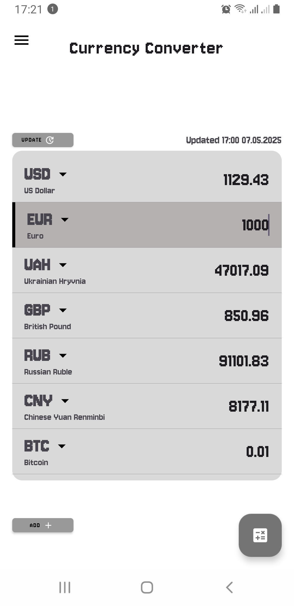
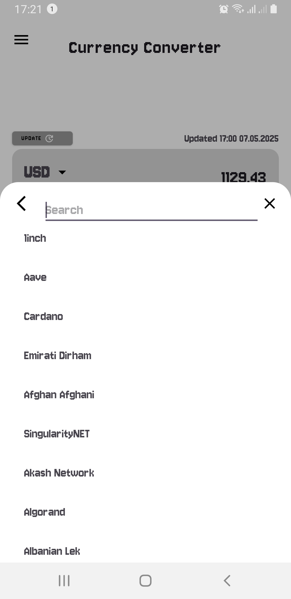
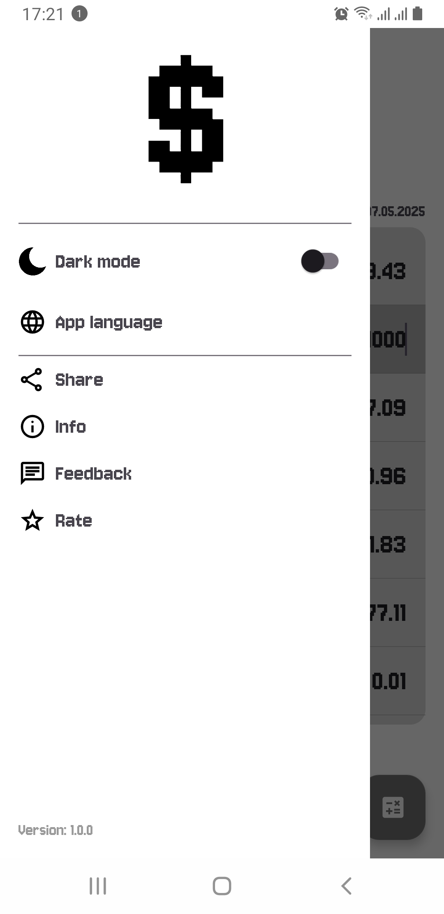
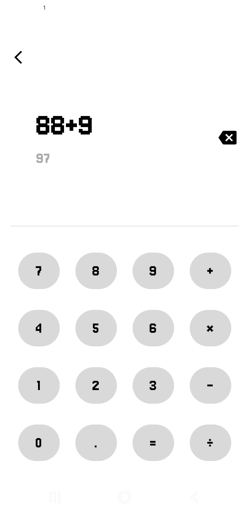

# Curency Converter

First grance at clean architecture, **Kotlin | View(Xml) | Retrofit**

Convert between over 200+ world currencies instantly, with up‑to‑date exchange rates fetched in real time.

## Features

- **Easy to Use**  
  Tap any currency to set it as your base, enter an amount, and see all other values recalculate instantly.

- **Customizable List**  
  Add, reorder or remove currencies so your favorites are always at your fingertips.

- **Light & Dark Themes**  
  Switch between day and night modes from the side menu.

- **Built‑in Calculator**  
  Quick access to a simple calculator for multi‑step calculations without leaving the app.

- **Offline Handling**  
  If you lose connectivity you’ll see an error placeholder and can retry once you’re back online.

## Quick Start

1. Clone the repo:  
  [ git clone https://github.com/your‑user/ccurrency‑converter.git](https://github.com/denny24s/CurrencyConverter.git)
